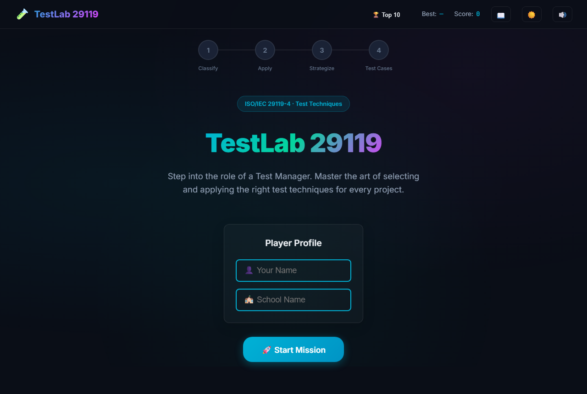
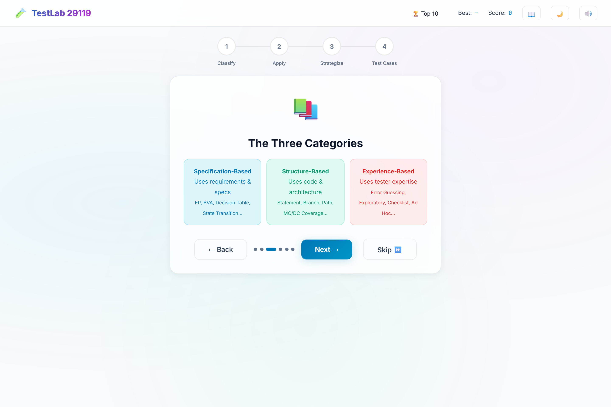
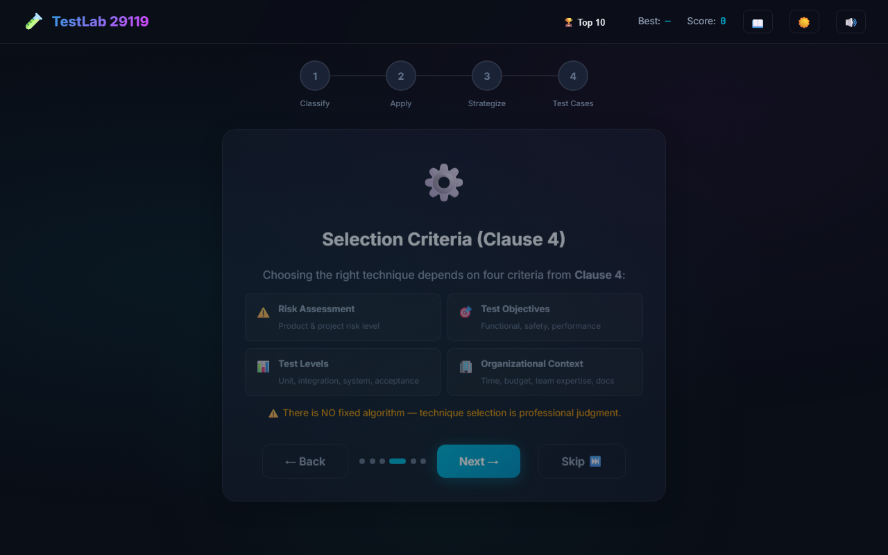
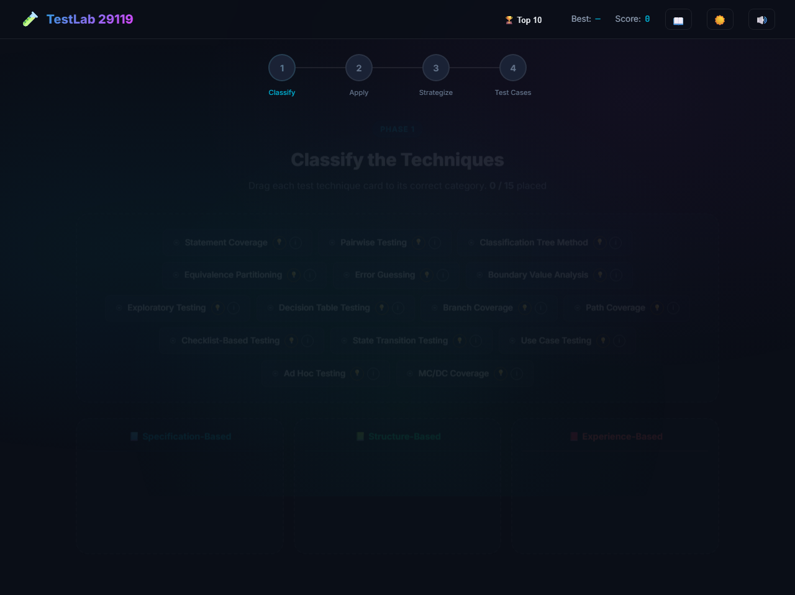
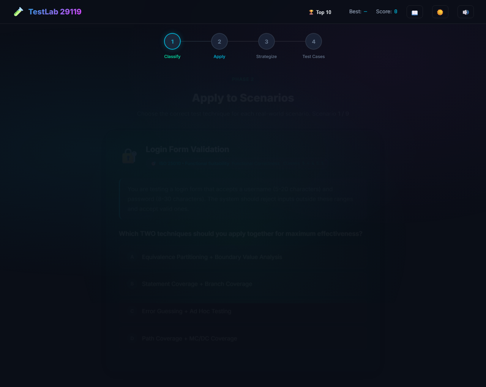
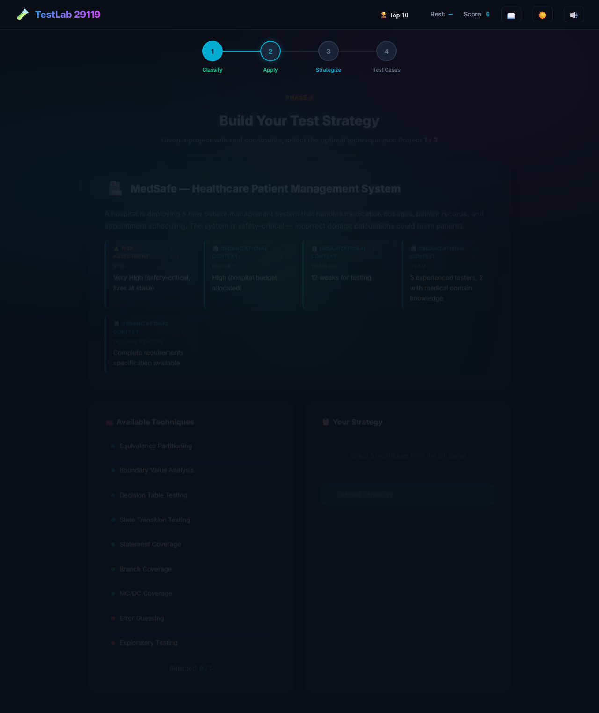
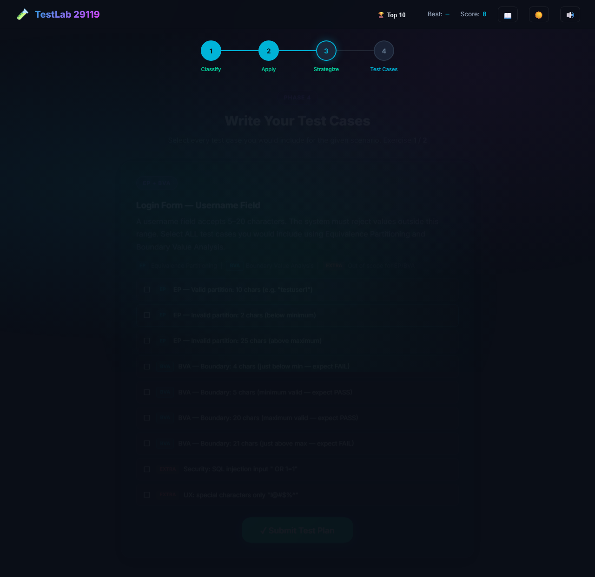
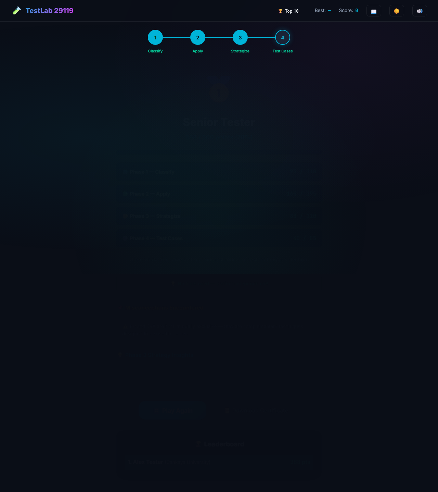
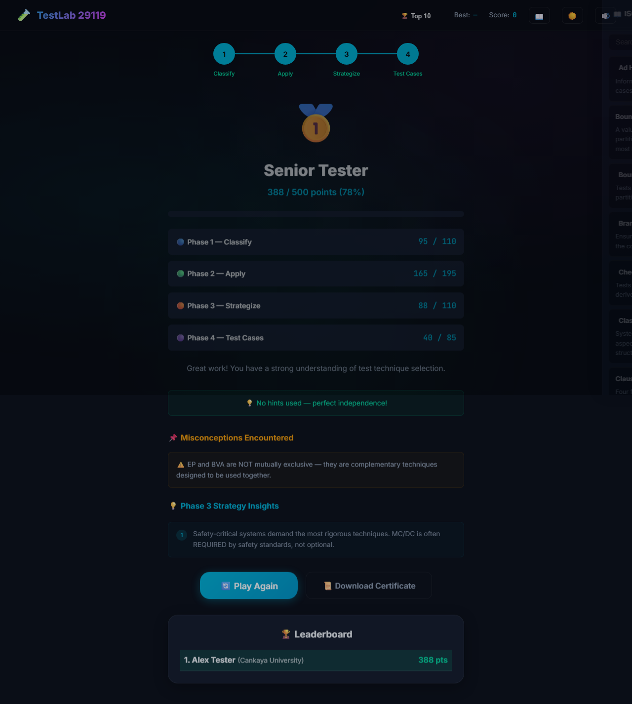

# TestLab 29119 — User Manual

**Course:** SENG 436 — Learner-as-Designer Project  
**Institution:** Çankaya University  
**Standards:** ISO/IEC 29119-4 (Test Techniques) · ISO/IEC 25010 (Quality Model)  
**Version:** 1.0 · May 2026

---

## 1. Introduction

**TestLab 29119** is a browser-based educational serious game. You play the role of a **Test Manager** who must classify, apply, and select ISO/IEC 29119-4 test design techniques for realistic software projects. The game reinforces correct technique choice—not memorization of definitions alone—through four progressive phases and immediate feedback.

---

## 2. System Requirements

| Requirement | Details |
|-------------|---------|
| **Browser** | Recent Chrome, Microsoft Edge, or Firefox |
| **JavaScript** | Must be enabled |
| **Internet** | Required for Google Fonts (optional fallback to system fonts) |
| **Storage** | `localStorage` used for best score, leaderboard, and theme |
| **Installation** | None (web application) |

---

## 3. How to Access the Game

### Online (recommended for submission)

**Live URL:** https://ismaiidogan.github.io/TestLab-29119/

### Local (development or offline demo)

```bash
npm install
npm start
```

Open `http://localhost:3000` in your browser.

---

## 4. Game Overview

| Item | Description |
|------|-------------|
| **Maximum score** | 500 points |
| **Phases** | 4 + Results |
| **Duration** | Approximately 25–40 minutes (first playthrough) |
| **Language** | English |

### Phase summary

| Phase | Name | Max points | Skill tested |
|-------|------|------------|--------------|
| 1 | Classify | 110 | Map techniques to Specification / Structure / Experience categories |
| 2 | Apply | 195 | Choose techniques for nine realistic scenarios |
| 3 | Strategize | 110 | Build a technique mix for three projects (Clause 4 constraints) |
| 4 | Test Cases | 85 | Select required EP and BVA test cases |
| — | Results | — | Grade, misconceptions, certificate, leaderboard |

---

## 5. Getting Started

### 5.1 Welcome screen

1. Optionally enter **Your Name** and **School Name** (used on the leaderboard and certificate).
2. Click **Start Mission** to open the tutorial.
3. Defaults: `Anonymous` / `Unknown School` if fields are left empty.

### 5.2 Tutorial (six slides)

| Slide | Topic |
|-------|--------|
| 1 | Welcome — Test Manager role |
| 2 | ISO/IEC 29119-4 — three technique categories |
| 3 | The three categories (Specification / Structure / Experience) |
| 4 | Clause 4 selection criteria |
| 5 | ISO/IEC 25010 link to Phase 2 scenarios |
| 6 | Your mission — overview of all four phases |

- Use **Next** / **Back** and the dot indicator to navigate.
- Click **Skip** to go directly to Phase 1.
- On the last slide, **Start Phase 1** begins the game.

---

## 6. Phase-by-Phase Instructions

### Phase 1 — Classify the Techniques

**Goal:** Drag each of **15 technique cards** into the correct category drop zone.

| Zone | Category |
|------|----------|
| Blue | Specification-Based |
| Green | Structure-Based |
| Red | Experience-Based |

**Actions:**

- **Drag and drop** cards from the pool into a zone.
- **i** button — opens ISO detail modal (clause, description, best use).
- **Hint** button — reveals a hint; costs **4 points** per first use on each card.
- When all cards are placed, click **Check Answers**.
- Correct placements are highlighted in green; wrong cards show feedback with the correct category.
- Click **Continue to Phase 2** when finished.

**Scoring:** 6 points per correct card; +20 bonus if all 15 are correct; hint penalties subtracted from Phase 1 total (max 110).

---

### Phase 2 — Apply to Scenarios

**Goal:** Answer **9 multiple-choice scenarios** by choosing the best test technique(s).

**Features:**

- Each scenario shows context, a question, and four options (A–D).
- **Keyboard:** Press `A`, `B`, `C`, or `D` to select; `Escape` closes modals.
- **ISO/IEC 25010 badge** on the scenario header links quality characteristics to the scenario.
- Some scenarios are **comparison mode** (e.g. EP vs BVA, Exploratory vs Ad Hoc).
- After answering, read **correct/wrong feedback** and any **misconception** note.
- Click **Next Scenario** until all nine are complete.

**Scoring:** 20–25 points per scenario (max 195 for Phase 2).

---

### Phase 3 — Build Your Test Strategy

**Goal:** For each of **three projects**, select up to **five** test techniques that best fit the constraints.

**Projects:**

1. MedSafe — Healthcare (safety-critical)
2. QuickMVP — Startup food delivery (time/budget limited)
3. MigrateX — Legacy ERP migration (undocumented rules)

**Actions:**

- Read **constraints** (risk, budget, timeline, team, documentation).
- Click techniques to select/deselect (maximum 5).
- Hover for a quick preview; use the glossary (book icon) for ISO terms.
- Click **Submit Strategy** to see score, optimal selection, expert analysis, and key insight.
- Click **Next Project** or **Continue to Phase 4** on the last project.

**Scoring:** Up to 37 / 37 / 36 points per project (max 110). Partial credit applies; there is no single fixed algorithm—matching Clause 4 professional judgment.

---

### Phase 4 — Write Your Test Cases

**Goal:** For **two exercises**, select all **required** EP and BVA test cases (checkboxes).

**Exercises:**

1. Login form — username field (5–20 characters)
2. Age field — insurance discount (18–65 inclusive)

**Actions:**

- Click rows to toggle selection.
- Click **Submit** to see coverage feedback (correct, missed, or unnecessary selections).
- Extra (non-required) selections incur a small penalty.
- Click **Next Exercise** or **See Final Results** on the last exercise.

**Scoring:** Up to 42 and 43 points (max 85). Each required item = 6 points when selected.

---

## 7. Scoring and Grades

### Total score

Your **total** is the sum of all four phase scores (max **500**). The navbar **Score** updates as you play; **Best** stores your highest total in this browser.

### Grade tiers (percentage of 500)

| Grade | Minimum % | Title |
|-------|-----------|--------|
| ISO Master | 90% | Outstanding mastery |
| Senior Tester | 75% | Strong understanding |
| Test Engineer | 60% | Good basics |
| Junior Tester | 40% | Learning in progress |
| Trainee | 0% | Review recommended |

---

## 8. User Interface Reference

### Navbar (top)

| Control | Function |
|---------|----------|
| **Top 10** | Local leaderboard (this browser only) |
| **Best** | Highest total score saved locally |
| **Score** | Current run total |
| **Book** | ISO reference glossary (searchable) |
| **Sun/Moon** | Light / dark theme |
| **Speaker** | Mute / unmute sound effects |

### Phase progress bar

Shows four steps: **Classify → Apply → Strategize → Test Cases**. Active and completed steps are highlighted during gameplay.

---

## 9. Results Screen

After Phase 4 you will see:

- **Grade title** and emoji (e.g. ISO Master)
- **Total points** and percentage
- **Animated progress bar**
- **Per-phase score breakdown**
- **Misconceptions encountered** (learning points from wrong answers)
- **Phase 3 key insights**
- **Hint usage** summary (Phase 1)
- **Download Certificate** — PNG file with your name, grade, and scores
- **Play Again** — returns to welcome (scores reset for a new run)

---

## 10. Troubleshooting

| Problem | Solution |
|---------|----------|
| Score or leaderboard wrong | Data is per-browser; clear site data or use another browser |
| Fonts look plain | Check internet connection (Google Fonts CDN) |
| Drag-and-drop not working | Use a desktop browser; refresh the page |
| Game does not load | Ensure JavaScript is enabled; use the GitHub Pages URL or `npm start` |

---

## 11. Appendix A — Screenshot Walkthrough

TestLab 29119 is a web application accessed via URL. The following screens document the user interface in play order.

### 1. Welcome — Player profile



Enter name and school, then **Start Mission**. Profile data appears on the certificate and leaderboard.

### 2. Tutorial — Three technique categories



Introduces Specification-Based, Structure-Based, and Experience-Based groups (ISO/IEC 29119-4).

### 3. Tutorial — Clause 4 selection criteria



Risk, objectives, test levels, and organizational context—the foundation for Phase 3.

### 4. Phase 1 — Classify



Drag fifteen technique cards into the three category drop zones.

### 5. Phase 2 — Scenario with ISO 25010 badge



Nine multiple-choice scenarios; each shows an ISO/IEC 25010 quality characteristic badge.

### 6. Phase 3 — Test strategy



Select up to five techniques per project given risk, budget, timeline, team, and documentation constraints.

### 7. Phase 4 — Test case selection



Choose required EP and BVA test cases via checkboxes.

### 8. Results — Score and grade



Total score, grade tier, phase breakdown, misconceptions, and certificate download.

### 9. ISO reference glossary



Searchable glossary available from the navbar book icon during play.

---

*End of User Manual*
