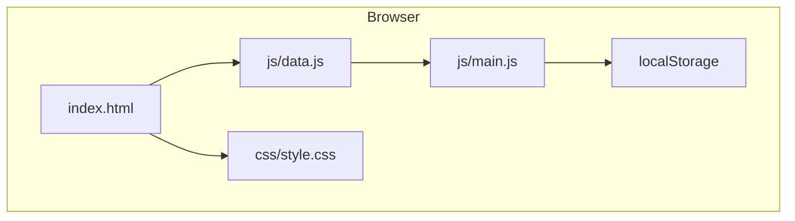

# For Developers

TestLab 29119 is a **static web application** with no build step and no backend.

---

## Architecture



| File | Responsibility |
|------|----------------|
| [index.html](https://github.com/ismaiidogan/TestLab-29119/blob/main/index.html) | UI shell, screens, `onclick` handlers |
| [js/data.js](https://github.com/ismaiidogan/TestLab-29119/blob/main/js/data.js) | Techniques, scenarios, scoring constants, tutorial |
| [js/main.js](https://github.com/ismaiidogan/TestLab-29119/blob/main/js/main.js) | Game state, navigation, scoring, audio, certificate |
| [css/style.css](https://github.com/ismaiidogan/TestLab-29119/blob/main/css/style.css) | Themes, layout, phase styles |

**Design pattern:** Content (`data.js`) is separated from logic (`main.js`). Global `GameState` object holds runtime state.

---

## Local development

```bash
git clone https://github.com/ismaiidogan/TestLab-29119.git
cd TestLab-29119
npm install
npm start
```

Open `http://localhost:3000`.

### npm scripts

| Script | Command | Purpose |
|--------|---------|---------|
| `start` | `npx serve . -p 3000` | Local static server |
| `test` | `playwright test` | Smoke + screenshot tests |

---

## Testing

Playwright end-to-end tests live in `tests/`:

- `smoke.spec.js` — welcome, tutorial, glossary  

Run: `npm test`

---

## Extending content

To add a Phase 2 scenario, edit `PHASE2_SCENARIOS` in `js/data.js` and ensure `SCORING.phase2.maxScore` equals the sum of scenario `points` values.

To add a technique to Phase 1, add an entry to both `TECHNIQUES` and `PHASE1_CARDS`, then update `SCORING.phase1.maxScore` (15 × 6 + 20 bonus).

---

## Persistence keys

| Key | Purpose |
|-----|---------|
| `testlab-best` | Highest total score |
| `testlab_leaderboard` | Top scores (local) |
| `testlab_theme` | `light` or dark |

---

## Related pages

- [Deployment](Deployment)  
- [Home](Home)
