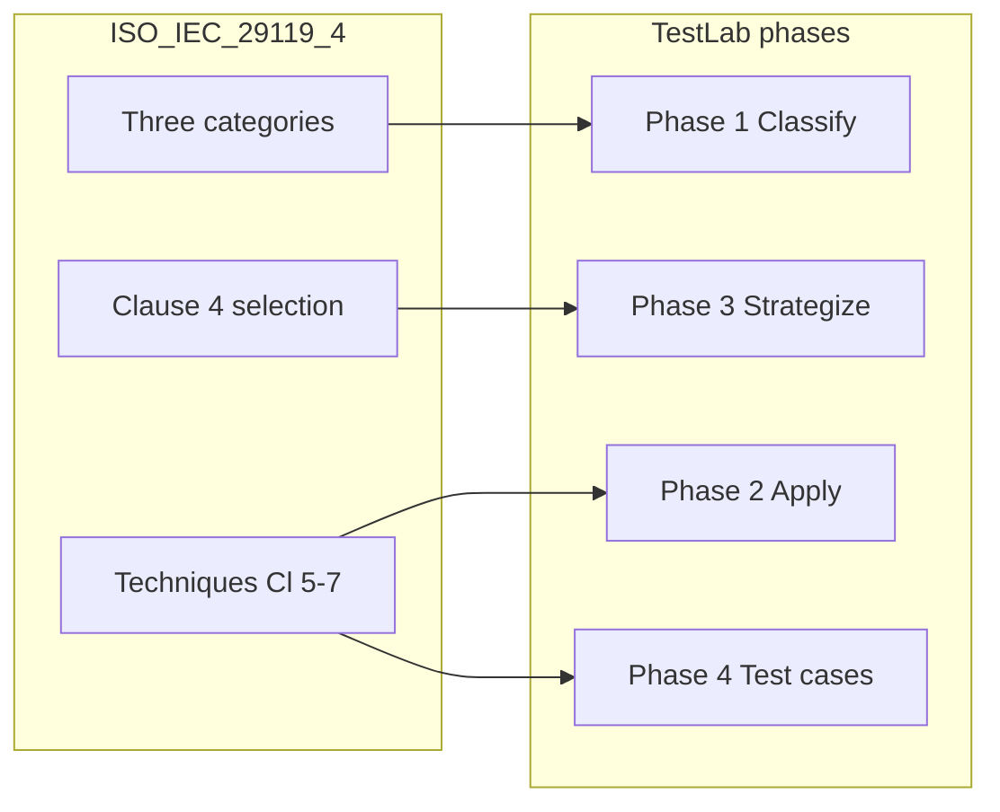

# ISO Standards Alignment

TestLab 29119 is designed around two international standards used in software quality and testing education.

---

## ISO/IEC 29119-4 — Test Techniques

Part 4 of the ISO/IEC 29119 series defines **test design techniques** grouped by the **source of knowledge** used to create test cases:

| Category | Knowledge source | Game phase |
|----------|------------------|------------|
| Specification-Based | Requirements and specifications | Phase 1, 2, 4 |
| Structure-Based | Code and architecture | Phase 1, 2 |
| Experience-Based | Tester expertise | Phase 1, 2, 3 |

### Clause mapping

| Standard area | Game content |
|---------------|--------------|
| **Clause 4** — Selection criteria | Tutorial; Phase 3 project constraints (risk, objectives, levels, organizational context) |
| **Clauses 5–7** — Specification-based techniques | Phase 1 cards; Phase 2 scenarios; Phase 4 EP/BVA |
| **Clause 6** — Structure-based techniques | Phase 1 cards; Phase 2 coverage scenarios |
| **Clause 7** — Experience-based techniques | Phase 1 cards; Phase 2 legacy/exploratory scenarios; Phase 3 strategy |

### Pedagogical emphasis

The game repeatedly reinforces that:

- Specification-based ≠ “black-box” and structure-based ≠ “white-box” as the primary taxonomy.  
- **EP and BVA are complementary**, not alternatives.  
- **100% coverage does not guarantee quality.**  
- **Technique selection is contextual judgment**, not a fixed algorithm (Clause 4).

See [Technique Reference](Technique-Reference) for all fifteen techniques with ISO clause numbers.

---

## ISO/IEC 25010 — Quality Model

ISO/IEC 25010 defines product quality characteristics. In **Phase 2**, each scenario displays an **ISO 25010 badge** linking the testing goal to a quality property.

| Quality characteristic (examples) | Typical technique focus in game |
|-----------------------------------|--------------------------------|
| Functional Suitability | EP, BVA, Decision Tables |
| Reliability | State Transition Testing |
| Security | Error Guessing, Exploratory Testing |
| Maintainability / Testability | Branch Coverage, MC/DC |

These badges are **pedagogical labels**—they illustrate *what* is being verified, not a one-to-one mapping of every technique to a single quality characteristic.

---

## Learning progression vs standard structure

---

## Related pages

- [Technique Reference](Technique-Reference)  
- [Pedagogy](Pedagogy)  
- [Game Phases](Game-Phases)
